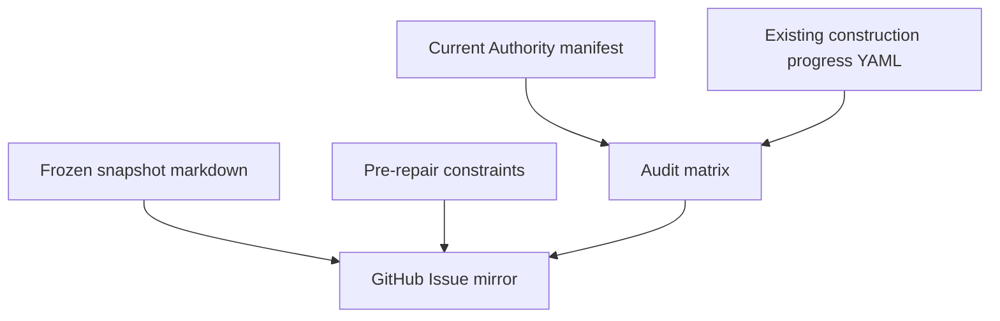

# Strict Construction Audit Monitor

Feature Name: 2026-09-08-strict-construction-audit-monitor
Updated: 2026-09-08

## Description

A construction-only audit surface that freezes the 2026-09-08 live deployment probe, constrains repair before the next authorized deployment, and scores every registered page, runtime port, dependency, and related program with strict status. The surface is this specs directory plus one GitHub Issue. It does not add a product page, nav item, or second ACPOS system.

## Architecture

Current monitor path: files in `.monkeycode/specs/2026-09-08-strict-construction-audit-monitor/` plus one GitHub Issue.

Deferred monitor path: feed the same matrix into existing SYS-01 `audit` / `raw_logs` composition only if that composition already exists in Current SYS-01 Authority. No new `page_uid`. No new route.

## Components and Interfaces

1. `FROZEN-DEPLOYED-AUDIT-SNAPSHOT.md`: immutable live HTTP and SHA freeze.
2. `PRE-REPAIR-CONSTRAINTS.md`: deploy block, no second system, no guessed routes.
3. `AUDIT-MATRIX.md`: one row per registered page, runtime bind, and dependency.
4. `requirements.md` / `design.md`: EARS requirements and this design.
5. GitHub Issue: independent mirror. Labels construction-audit only. No workflow change.

Blocked components:

- `src/app/audit/**`
- new `nav_id`
- replacement progress YAML
- live polling of production as a new runtime service

## Data Models

Audit row:

- `id`: stable string
- `layer`: PAGE | RUNTIME | DEPENDENCY | DOC | LIVE
- `page_uid_or_scope`: registered uid or global scope
- `strict_status`: 完整 | 已完成 | 未完成 | 待修正 | 已修正
- `authority_path`: exact Current Authority path or `AUTHORITY_GAP`
- `code_path`: exact repository path or `ABSENT`
- `live_http`: status plus reason_code or `NOT_PROBED`
- `evidence_path`: exact evidence path or `ABSENT`

## Correctness Properties

- A row with status 完整 has authority, code, evidence, and live SHA agreement.
- CONTROLLED_TEST evidence cannot set status 完整 for production.
- HTML 200 cannot set status 完整 for a command runtime.
- Missing cookie `IDENTITY_RUNTIME_NOT_BOUND` remains fail-closed identity, not production-ready.

## Error Handling

- Missing Current Authority mapping: `BLOCK + REPORT_AUTHORITY_GAP`
- Live SHA absent from git: 待修正
- Protected deployment 401: 未完成 for post-deploy smoke, not a product-page failure
- Proposed extra route for the monitor: blocked by `PRE-REPAIR-CONSTRAINTS.md`

## Test Strategy

- Diff this snapshot against later probes after the authorized deployment.
- Count matrix rows by strict status; 完整 count stays 0 until SHA, authority, code, and evidence match.
- Confirm GitHub Issue does not add files under `src/app` or `authority/global` navigation.

## References

- `docs/construction/ACPOS_WEBSITE_CONSTRUCTION_PROGRESS.yaml`
- `authority/global/ACPOS_WEBSITE_CONSTRUCTION_GOVERNANCE_FINAL_LOCKED_V1.0.yaml`
- `authority/pages/admin/SYS-01/ACPOS_SYS-01_SYSTEM_LIFECYCLE_AI_FINAL_DESIGN_ENCODING.yaml`
- `src/instrumentation.ts`
- `src/app/health/ready/route.ts`
