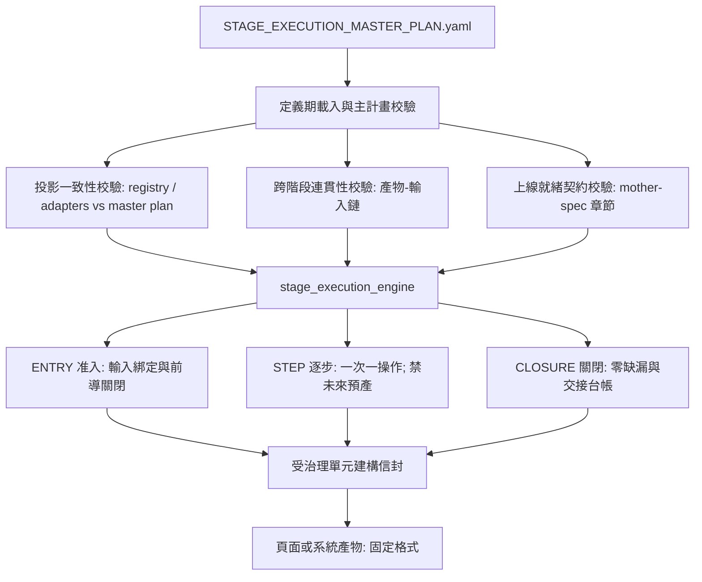

# Stage 執行主計畫與跨階段連貫性規範 — 技術設計

Feature Name: stage-execution-master-plan
Updated: 2026-09-30

## Description

本設計在 `rebuild-v2.1.1` 治理中新增一份獨立的權威定義檔 `STAGE_EXECUTION_MASTER_PLAN.yaml`，一次宣告 STAGE-01 至 STAGE-11 的完整執行契約（操作、產物、生產者、必要證據、必要規範章節、驗證器、掃描維度、跨階段交接與上線就緒欄位）。執行引擎在定義期載入此計畫並進行強制校驗，現有生命週期登錄與語意適配器改以「計畫投影」身分被交叉比對。此機制讓缺漏在定義期被攔下，讓每個受治理單元以同一套固定建構信封產出，並讓產物通過以 mother-spec 章節為基準的上線就緒閘門。

## 現況缺陷盤點

以現行登錄（`GOVERNANCE_LIFECYCLE_STAGE_REGISTRY.yaml`）與適配器為輸入，對 11 個 stage 進行一致性命中，得到以下缺口：

| 類別 | 位置 | 現象 |
|------|------|------|
| 懸空識別 | STAGE-02 | `conditional_operations`、`conditional_outputs`、`required_output_applicability` 引用 7 個未出現於 `outputs`/`output_producers` 的識別（`AI_INTERACTION_CONTINUITY_COMPILE`、`AI_INTERACTION_CONTINUITY_CONTRACT`、`ENTITY_HIERARCHY_MATRIX`、`FUNCTION_VISUAL_IMPACT_MATRIX`、`GOVERNED_ENTITY_INVENTORY`、`GOVERNED_ENTITY_OPERATION_MATRIX`、`INTERACTION_TOPOLOGY_MATRIX`） |
| 交接斷點 | STAGE-04 → STAGE-05 | STAGE-05 `entry_gate=CURRENT_GOVERNED_UNIT_FOUNDATION_FROZEN_AND_PREDECESSOR_STAGE_CLOSED` 與 STAGE-04 `exit_gate=CURRENT_GOVERNED_UNIT_FOUNDATION_FROZEN` 字面不一致 |
| 章節覆蓋 | STAGE-02/03/04 | 必要章節數與矩陣覆蓋需逐 stage 人工補列（例如 `WEB-GOV-01-S083A` 僅保證在 STAGE-04 被 checkpoint 覆蓋） |
| 定義期靜默 | 引擎 | `validate_definition_data`（`stage_execution_engine.py:259`）未斷言條件識別、章節成員、交接集合，上述缺口可通過 |
| 交接落地 | 執行期 | 跨階段交接目前由各 stage 關閉腳本自行補齊，缺少「上游產物集合等於下游輸入集合」的宣告級校驗 |

## Architecture



計畫為唯一權威，登錄與適配器為其投影；引擎在定義期先比對投影，再在進入、逐步、關閉三階段以同一份計畫核對實際產物。

## Components and Interfaces

### C1 主計畫定義檔

新增檔案：`.github/governance-source/active/source/10_REGISTRY/STAGE_EXECUTION_MASTER_PLAN.yaml`。

責任：宣告全生命週期的權威契約，涵蓋每個 stage 的 `entry_gate`、`exit_gate`、`next_stage_uid`、`inputs`、`operations`、`outputs`、`required_evidence`、`required_normative_sections`、`validators`、`scanners`、`handoff` 與 `production_readiness`。

介面：由 `governance/specifications/REGISTRY.yaml` 以鍵 `stage_execution_master_plan` 綁定路徑，作為治理入口之一。

### C2 主計畫載入與定義期校驗

新增引擎常數 `MASTER_PLAN`（`governance/ci/stage_execution_engine.py:15`）與單一函式 `validate_master_plan(stages)`，於 `validate_definition_data`（`stage_execution_engine.py:259`）末端呼叫，使 `--definition-audit-all` 一併涵蓋。此函式以 fail-closed 方式一次完成定義期全部檢核：

- 型別與權威模式：`artifact_type == STAGE_EXECUTION_MASTER_PLAN`、`authority_mode == EXECUTION_PROJECTION_ONLY`、`may_create_new_normative_requirement == false`。
- 分母一致：計畫的 `stage_uid` 集合等於生命週期登錄的 stage 集合。
- 建構信封：`construction_envelope.fixed_structure_across_pages_and_systems == true` 且 `page_specific_schema_variation == FORBIDDEN`。
- 投影一致性（C3，合併入同一函式）：以超集規則逐 stage 比對，登錄的每個操作／產物／必要證據／必要章節皆須存在於計畫，缺失回報 `MASTER_PLAN_PROJECTION_DRIFT:<stage>:<field>`。
- 產物有主與分類：每個產物有屬於同 stage 的 `producer_operation_uid`，且 `classification` 屬 `{HANDOFF, INTERNAL}`。
- 證據有主：每筆 `required_evidence` 有屬於同 stage 的 `producer_operation_uid`。
- 跨階段連貫性（C4，合併入同一函式）：`handoff.successor_stage_uid` 須等於登錄的 `next_stage_uid`，否則回報 `MASTER_PLAN_HANDOFF_STAGE_DRIFT`。
- 孤兒 invariant：`SINGLE_STATE_SINGLE_ORCHESTRATOR_STAGE_CORE` 須已綁定，否則回報 `MASTER_PLAN_ORPHAN_INVARIANT_UNBOUND`。

### C3 投影一致性校驗

見 C2「投影一致性」項。實作採「計畫為超集」規則：計畫可新增已核准宣告，但不得遺漏登錄中的權威宣告；遺漏即 `MASTER_PLAN_PROJECTION_DRIFT`。

### C4 跨階段連貫性校驗

見 C2「跨階段連貫性」項。實作以 `handoff.successor_stage_uid == next_stage_uid` 作為 stage 鏈封閉的定義期斷言；CLOSURE 階段的交接台帳期望集合沿用計畫宣告。

### C5 統一建構信封

主計畫每個 stage 的 `construction_envelope` 指向 `governance/execution-domains/STEP_CONTRACT_SCHEMA.yaml`，並宣告 `fixed_structure_across_pages_and_systems: true` 與 `page_specific_schema_variation: FORBIDDEN`。引擎於 `validate_work_unit_bindings`（`stage_execution_engine.py:588`）比對受治理單元使用的步驟欄位集合與信封一致，回報 `CONSTRUCTION_ENVELOPE_DRIFT`。

### C6 上線就緒閘門

主計畫每個 stage 的 `production_readiness.required_fields` 與 `production_readiness.required_sections` 以 mother-spec 章節為來源。引擎於 CLOSURE 階段的矩陣校驗中，對每個宣告為 `production_required` 的產物檢核必要欄位非空白、對每個 stage 檢核必要章節皆被矩陣覆蓋，缺失即回報 `PRODUCTION_READINESS_INCOMPLETE`。

### C7 缺漏可追溯

沿用 `CURRENT_PROBLEM_REGISTER` 與 `RESOLUTION_LEDGER`。引擎於檢核失敗時寫入具名缺漏列，含 `owner route`、`reentry stage`、`reverify requirement`；缺漏未清零時阻止 stage 關閉。

## Data Models

```yaml
artifact_type: STAGE_EXECUTION_MASTER_PLAN
artifact_uid: REG-STAGE-EXECUTION-MASTER-PLAN-001
governance_uid: <CURRENT_GOVERNANCE_UID>
profile_uid: REUSABLE-GOVERNED-UNIT-LIFECYCLE-PROFILE-11
common:
  phases: [<26 canonical phase_uids>]
  construction_envelope: governance/execution-domains/STEP_CONTRACT_SCHEMA.yaml
  fixed_structure_across_pages_and_systems: true
  page_specific_schema_variation: FORBIDDEN
stages:
  - stage_uid: STAGE-02
    order: 2
    name: GOVERNED_UNIT_FUNCTIONAL_CONTRACT
    entry_gate: CURRENT_GOVERNED_UNIT_STAGE1_CLOSED
    exit_gate: CURRENT_GOVERNED_UNIT_STAGE2_CLOSED
    next_stage_uid: STAGE-03
    inputs:
      - input_uid: GOVERNED_UNIT_BASE_BLUEPRINT
        origin_stage_uid: STAGE-01
        role: MUTABLE_REFERENCE
    operations:
      - operation_uid: GOVERNED_UNIT_FUNCTIONAL_CONTRACT_COMPILE
        applicability: REQUIRED
        producer_outputs: [GOVERNED_UNIT_FUNCTIONAL_CONTRACT]
      - operation_uid: AI_INTERACTION_CONTINUITY_COMPILE
        applicability: CONDITIONAL
        condition: when_ai_interaction_profile_applies
        producer_outputs: [AI_INTERACTION_CONTINUITY_CONTRACT]
    outputs:
      - output_uid: GOVERNED_UNIT_CONSTRUCTION_SPEC_PACKAGE
        producer_operation_uid: GOVERNED_UNIT_CONSTRUCTION_SPEC_COMPILE
        applicability: ALWAYS_FOR_TARGET_SCOPE
        production_required_fields: [status]
    required_evidence:
      - evidence_uid: GOVERNED_UNIT_FUNCTIONAL_REVIEW_EVIDENCE
        producer_operation_uid: FUNCTION_ADMISSION_SCORECARD_COMPILE
    required_normative_sections: [WEB-GOV-01-S012, WEB-GOV-01-S083A]
    validators: [VAL-GOV-008, VAL-GOV-004]
    scanners: [FUNCTIONAL_COMPLETENESS]
    handoff:
      successor_stage_uid: STAGE-03
      successor_required_inputs: [GOVERNED_UNIT_CONSTRUCTION_SPEC_PACKAGE, FUNCTIONAL_WORKBENCH_CONTRACT]
    production_readiness:
      required_fields: [<mother-spec derived field paths>]
      required_sections: [<mother-spec section uids>]
```

## Correctness Properties

1. 計畫為唯一權威：登錄與適配器的每個 stage 欄位皆可由計畫推導。
2. 順序鏈封閉：對所有 i，`entry_gate[i] == exit_gate[i-1]` 且 `next_stage_uid[i-1] == stage_uid[i]`，首尾例外以計畫宣告的邊界 token 表示。
3. 交接集合對齊：每個 stage 的 `handoff.successor_required_inputs` 等於下一 stage 的 `inputs` 集合。
4. 產物有主：每個產物恰有一個生產者操作，且該操作屬於同 stage。
5. 條件可解析：所有條件式操作與產物引用的識別皆存在於同 stage 的操作或產物集合。
6. 章節可解析：所有必要規範章節皆存在於 `SECTION_NUMBER_REGISTRY.yaml`。
7. 建構信封唯一：所有受治理單元使用同一組固定步驟欄位與固定產物結構。
8. 上線語意唯一：通過判定以內容證據為依據。

## Error Handling

| 錯誤碼 | 觸發 | 處置 |
|--------|------|------|
| `MASTER_PLAN_MISSING` | 計畫檔不存在或未綁定 | 定義期終止 |
| `MASTER_PLAN_FIELD_MISSING:<stage>:<field>` | 必要欄位缺值 | 定義期終止並列出欄位 |
| `MASTER_PLAN_DANGLING_REF:<stage>:<ref>` | 條件引用懸空 | 定義期終止 |
| `MASTER_PLAN_CONTINUITY_BREAK:<i>:<ke>` | 閘門或順序鏈斷裂 | 定義期終止 |
| `MASTER_PLAN_HANDOFF_SET_DRIFT:<stage>` | 交接集合與下一 stage 輸入不符 | 定義期終止 |
| `MASTER_PLAN_PROJECTION_DRIFT:<stage>:<field>` | 登錄或適配器與計畫不一致 | 定義期終止 |
| `MASTER_PLAN_SECTION_UNRESOLVED:<uid>` | 章節不存在於章節登錄 | 定義期終止 |
| `CONSTRUCTION_ENVELOPE_DRIFT:<stage>` | 受治理單元步驟欄位與信封不符 | 進入期終止 |
| `PRODUCTION_READINESS_INCOMPLETE:<stage>:<item>` | 上線就緒欄位或章節缺失 | 關閉期阻止 |

## Test Strategy

1. 定義期測試：新增獨立驗證器 `.github/governance-source/active/source/09_TESTS/governance/validate_stage_execution_master_plan.py`（C-A..C-I 九類校驗）與回歸測試 `.github/governance-source/active/source/09_TESTS/governance/test_stage_execution_master_plan.py`（6 案，含注入缺陷 fail-closed：懸空生產者、登錄操作被丟棄、非法分類、證據被丟棄、閘門鏈斷裂等），斷言對應錯誤碼。
2. 端到端測試：以 `--definition-audit-all` 斷言 `stages=11/11`、`phases=26/26` 且 0 個主計畫錯誤。
3. 回歸測試：對既有 `GLOBAL-HOME-SHELL-NAVIGATION` 的 STAGE-01..04 已關閉證據重跑 `--validate-evidence` 與 `--validate-closure`，斷言維持 PASS。
4. 信封測試：以兩個不同型別的受治理單元建構輸入斷言步驟欄位集合一致。

## Implementation Status

- 沙盤推演（唯讀、非 effectful）：CURRENT=18 缺口（8 HIGH 集中 STAGE-02 懸空引用、10 MEDIUM 證據／孤兒），套用已核准之 5 點提議宣告後 FIXED=**0**；其餘 10 站閘門／順序／輸入／章節全數通過。報告：`.monkeycode/specs/stage-execution-master-plan/sandbox-report.md`。
- 已落地：`10_REGISTRY/STAGE_EXECUTION_MASTER_PLAN.yaml`（11 stages／121 operations／65 outputs／13 evidence，HANDOFF=23、INTERNAL=42，32 筆 declared_additions）、驗證器、回歸測試、引擎 `validate_master_plan` 串接、`REGISTRY.yaml` 新增 `stage_execution_master_plan` 綁定與兩條 validation command。
- 落地驗證分支：`rebuild-v2.1.1`（worktree `/tmp/opencode/rebuild-v2.1.1`）。`--definition-audit-all`、主計畫驗證器、回歸測試、`validate_stage_execution_invariants`、`validate_current_source_package`、`validate_governance_layout`、`validate_selected_execution_profile_integrity`、`validate_active_consumer_reference_integrity`、`validate_successor_governance_preformal` 全數 PASS。

## Migration

1. 由現行登錄與適配器生成 `STAGE_EXECUTION_MASTER_PLAN.yaml` 初稿，保留現有資料。
2. 首次執行 `--definition-audit-all`，取得現況缺口清單（含 STAGE-02 懸空識別與 STAGE-04/05 閘門差異）。
3. 修正缺口：STAGE-02 條件識別改以 `conditional` 產物列表達；STAGE-05 進入閘門於計畫中以雙條件 token 明示；S083A 於計畫中對所有適用 stage 宣告並由矩陣覆蓋。
4. 引擎加入 C2 至 C7 校驗並補測試。
5. 全程於治理分支 `rebuild-v2.1.1` 進行，通過後同步 `governance/` 至執行工作區 `/workspace`。

## References

- `governance/ci/stage_execution_engine.py:259` — `validate_definition_data`
- `governance/ci/stage_execution_engine.py:588` — `validate_work_unit_bindings`
- `governance/ci/stage_execution_engine.py:775` — `validate_normative_execution_matrix`
- `.github/governance-source/active/source/10_REGISTRY/GOVERNANCE_LIFECYCLE_STAGE_REGISTRY.yaml:186` — STAGE-01 起點
- `.github/governance-source/active/source/10_REGISTRY/STAGE_EXECUTION_INVARIANT_REGISTRY.yaml` — 69 條 stage invariant
- `.github/governance-source/active/source/10_REGISTRY/SECTION_NUMBER_REGISTRY.yaml` — 章節登錄
- `.github/governance-source/active/source/12_DOCS/mother-spec/01_BLUEPRINT_DESIGN_GOVERNANCE.md:1700` — §83A 逐步撰寫與審查流程
- `.github/governance-source/active/source/12_DOCS/mother-spec/03_EXECUTION_CONTROL_STANDARD.md:1061` — §S062A 通用逐步執行
- `governance/execution-domains/STEP_CONTRACT_SCHEMA.yaml` — 固定步驟欄位 schema
- `governance/execution-domains/AUDIT_PROFILE.yaml` — 每步稽核 profile
